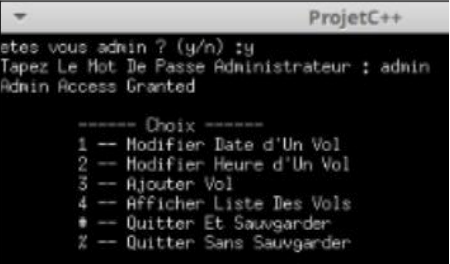
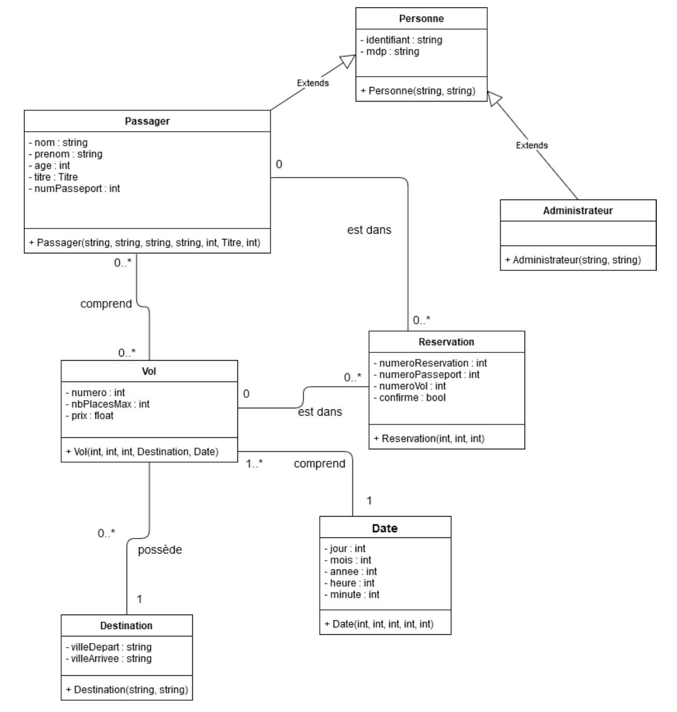
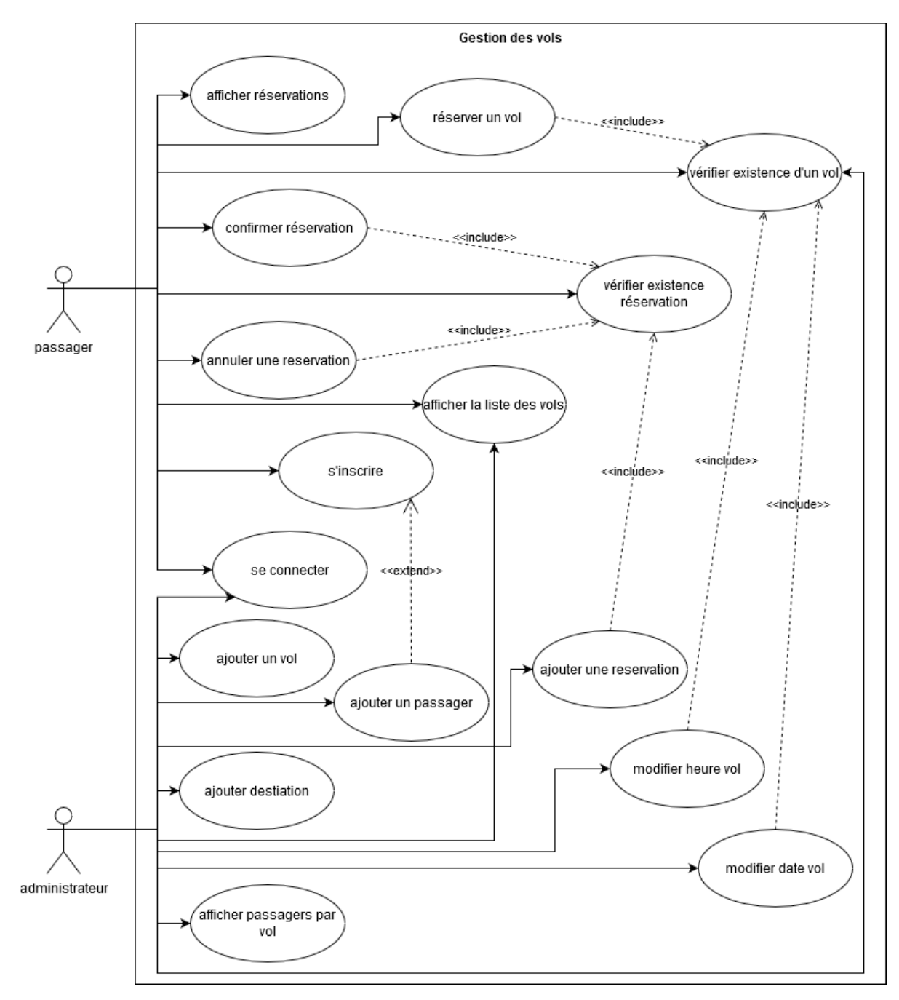

<h1 align="center"> Programme de réservation de vols C++</h1> 

     

<strong> Création d’une application de gestion des vols pour une compagnie aérienne en langage C++ </strong>

>## Description générale du programme

>### Fonctionnement global
Le programme est composé de différents menus, chacun offrant des options sous forme de numéro. On saisie le numéro pour pouvoir avoir accès à l’action associée. Afin de vérifier la saisie (surtout pour les int), on se sert des fonctions précédemment citées.  
Afin de ne pas ré afficher le menu après avoir fait une action, on demande au système de se mettre en pause (system(‘’PAUSE’’)). Si les actions amènent à des modifications dans les listes, elles sont sauvegardées directement afin d’éviter de perdre les informations en cas de mauvaise manipulation ou d’arrêt du programme de force.

>### Conteneurs C++
Pour stocker les différents composants du système, nous nous sommes servis de listes de pointeurs (pour pouvoir modifier les éléments directement).

> ### Sauvegarde et chargement en mémoire 

Afin de simplifier la sauvegarde et le chargement, une classe ManipulateurFichier a été créée. Elle sert notamment à écrire plusieurs lignes directement dans un fichier dont on communique le chemin d’accès.
Les classes pouvant être sauvegardées héritent de la classe Sauvegardable.
Au début du programme, on déclare les listes qui contiendront les différents éléments (comme les passagers, les vols, etc).
Chaque classe qui hérite de Sauvegardable implémente les fonctions :
- toSave() qui retourne sous forme de string les informations à sauvegarder
- save(list<*>, string) qui pour chaque élément de la liste écrit dans le fichier ce
  que retourne la méthode toSave()
- load(string) qui retourne une liste de pointeur sur les éléments, laquelle est
  ensuite associée aux listes déclarées précédement.
  La fonction load se sert du manipulateur de fichier afin de récupérer les lignes du fichier, puis les sépare dans une liste de lignes. Pour chaque liste de lignes, on les sépare avec la méthode split() de Helper et on ajoute chaque morceau dans un vecteur. En fonction de la position dans le vecteur, on crée les variables de l’objet avant de le créer lui-même.
  On ajoute ensuite l’objet créé à la liste globale lui correspondant.
  
> ### Accès aux listes dans les différentes classes 

Afin d’accéder aux listes dans les différentes classes, on utilise le mot-clé ‘extern’ dans la classe. Ex : extern list<Passager*> passagers.
L’utilisation de variable statique dans les classes aurait aussi pu être mise en œuvre, mais nous avons préféré passer par des variables globales au programme.

> ### Outils pour simplifier la manipulation des données

Comme la saisie d’informations est très présente, nous avons créé une classe Helper regroupant des fonctions utiles comme la fonction
saisirEntier(&valeur, min, max, message) qui demande la saisie d’un entier tant qu’il n’est pas entre min et max, ou encore la fonction toInt(string) qui transforme un string en int.
  
>## Diagrammes UML

      
    <i> Diagramme de classes </i> 

       
    <i> Diagramme de cas d'utilisations </i> 

